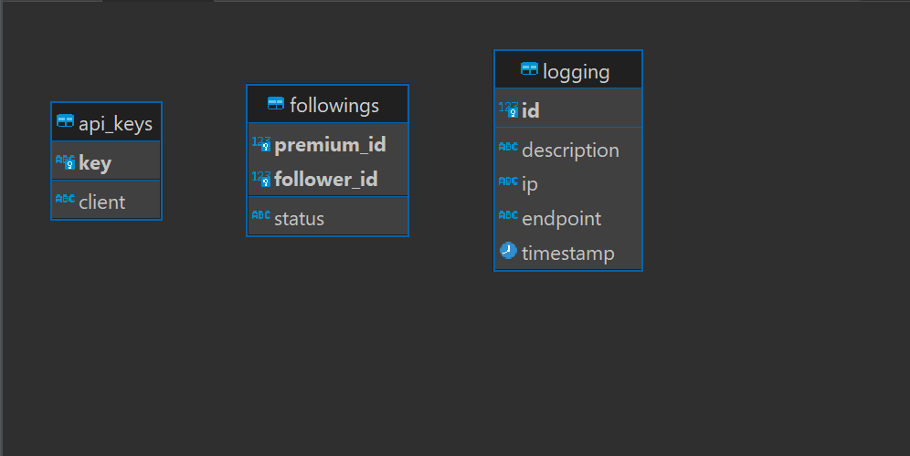

# Sevenify - SOAP

## Deskripsi SOAP Web Service
SOAP atau Simple Object Access Protocol adalah protokol komunikasi yang digunakan untuk pertukaran pesan berbasis XML di lingkungan web service. Protokol ini memungkinkan aplikasi saling berkomunikasi dengan  format pesan XML(Extensible Markup Language) yang terstruktur. Pesan SOAP terdiri dari elemen-elemen XML yang menentukan informasi tentang pesan dan tindakan yang harus dilakukan, seperti apa yang harus dilakukan oleh layanan web tertentu. Dengan SOAP, pesan dikirim melalui protokol seperti HTTP.

## Skema Basis Data 

## Cara Instalasi
1. Lakukan clone repository ini : `git clone https://github.com/Rinaldy-Adin/sevenify-soap.git`
2. Konfigurasi project structure untuk include lib jar
3. Buat database sesuai pada `migration\init.sql`
4. Jalankan project

## Pembagian Tugas
Fungsi Followers : 13521134  
Logging : 13521134 

## Anggota Kelompok
10023174 Ilham Syam 
13521077 Husnia Munzayana 
13521134 Rinaldy Adin 
